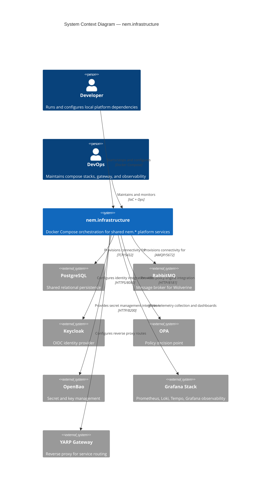

# Architecture — nem.infrastructure

## Executive Summary

`nem.infrastructure` provides shared Docker Compose configurations, reverse proxy setup, and infrastructure tooling for the nem.* platform. This document describes the architectural decisions, component structure, and integration patterns.

### Design Principles

- **Single Responsibility**: Each component owns one bounded context
- **Fail-Closed**: Security and authorization reject by default
- **Observable**: OpenTelemetry instrumentation on all boundaries
- **Testable**: Dependency injection enables isolated testing

## System Context

### External Dependencies

| Dependency | Purpose | Protocol |
|------------|---------|----------|
| PostgreSQL | Persistent storage (Marten) | TCP/5432 |
| RabbitMQ | Async messaging (Wolverine) | AMQP/5672 |
| Keycloak | Authentication (OIDC) | HTTPS |
| OPA | Authorization (policy eval) | HTTP/8181 |
| OpenBao | Secret management | HTTP/8200 |

### Integration Points

The service integrates with the nem.* ecosystem through:

- **Wolverine messaging**: Command and event handling via RabbitMQ
- **REST APIs**: Synchronous request/response for queries
- **Shared contracts**: Types from `nem.Contracts` for cross-service communication

## Component Architecture

### Project Structure

The solution follows Clean Architecture with these layers:

| Layer | Purpose |
|-------|---------|
| Domain | Core business logic, aggregates, value objects |
| Application | Use cases, command/query handlers |
| Infrastructure | Persistence, messaging, external integrations |
| API | HTTP endpoints, request/response mapping |

### Key Patterns

- **CQRS**: Command/query separation through Wolverine handlers
- **Event Sourcing**: Domain events stored via Marten event store where applicable
- **Strongly-Typed IDs**: All entity identifiers use types from `nem.Contracts`
- **Mapperly**: Source-generated mapping between layers (no AutoMapper)

## Technology Stack

| Technology | Version | Purpose |
|------------|---------|---------|
| .NET | 10 | Runtime platform |
| Marten | Latest | Document DB on PostgreSQL |
| Wolverine | Latest | Messaging and CQRS |
| FluentValidation | Latest | Input validation |
| Serilog | Latest | Structured logging |
| OpenTelemetry | Latest | Observability |

## Cross-References

- [QA.md](./QA.md) — Testing strategy and quality gates
- [INFRASTRUCTURE.md](./INFRASTRUCTURE.md) — Deployment and operations

## Additional Context

### Integration with nem.* Ecosystem

This component integrates with the broader nem.* microservice ecosystem through standard platform conventions:

- **Messaging**: Wolverine handlers for asynchronous command and event processing via RabbitMQ
- **Authentication**: Keycloak-issued JWT tokens validated on all API endpoints
- **Authorization**: OPA policy evaluation with fail-closed default behavior
- **Observability**: OpenTelemetry instrumentation for distributed traces, metrics, and structured logging
- **Configuration**: `IConfigurationManager` pattern for runtime-configurable settings via nem.MCP

### Related Resources

- Platform documentation: Available through the nem.MCP administration portal
- Architecture Decision Records: Located in the ecosystem-level `docs/` directory
- Glossary: Standard terminology defined in the ecosystem glossary
