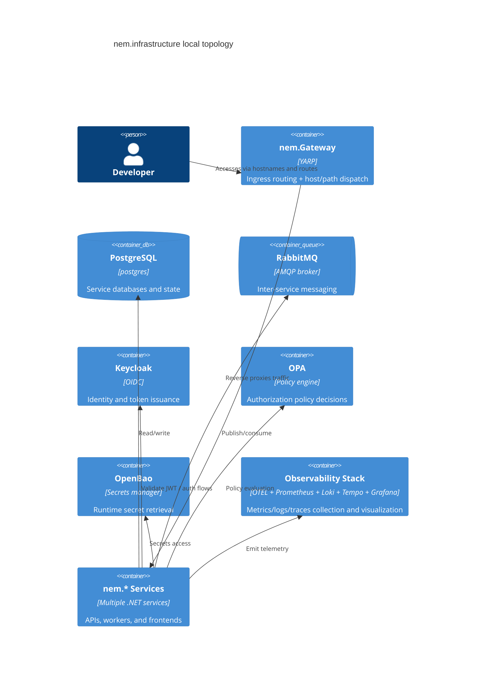

<!-- sync-hash: 36d5a8c093bbcfd97510257dbddb6f64 -->
# Infrastruktur-Dokumentation: nem.infrastructure

## Zusammenfassung
`nem.infrastructure` definiert die lokale und Entwicklungs-Deployment-Topologie für das nem-Ökosystem. Es stellt Compose-basierte Stacks für Kernabhängigkeiten (Datenbank, Broker, Identität, Policy, Secrets), Observability-Komponenten und ein YARP-Gateway bereit, das Host-/Subdomain-Traffic an Service-Cluster routet.

## Deployment-Scope und Grenzen
- Besitzt Infrastructure-Compose-Dateien, Gateway-Konfiguration, Observability-Bereitstellung und Hilfsskripte.
- Besitzt keine Business-Logik einzelner nem.* Services.
- Unterstützt mehrere Laufmodi:
  - Voller lokaler Plattform-Stack (`docker-compose.yml`)
  - Classification-/Comms-fokussierter Stack (`docker-compose.classification.yml`)
  - RabbitMQ-only-Transport-Bootstrap (`docker-compose.rabbitmq.yml`)

## Topologieansicht (C4)

## Kern-Runtime-Komponenten
- **Gateway (`nem.Gateway`)**: lädt `yarp-gateway.json`, wendet env-basierte Cluster-Adress-Overrides an und stellt den Health-Endpunkt `/health` bereit.
- **Data & Messaging**: PostgreSQL 17, RabbitMQ 3.13 Management-Image plus optionale postgres-exporter/cAdvisor-Metriken.
- **Security Plane**: Keycloak (OIDC), OPA für Policy-Checks, OpenBao für Secrets.
- **Observability Plane**: OTEL-Collector-Fan-in mit Prometheus (Metriken), Loki (Logs), Tempo (Traces), Grafana-Dashboards/Alerts.

## Compose- und Routing-Verträge
- `docker-compose.yml` erwartet das externe Netzwerk `nem-network` und mountet `./yarp-gateway.json` in den Gateway-Container.
- `docker-compose.classification.yml` verwendet profile-scoped Services und `.env.classification` für umgebungsspezifische Werte.
- `yarp-gateway.json` enthält pfadbasierte API-Routen und Host-/Subdomain-Routen mit Prioritätsreihenfolge, inklusive expliziter Base-Path- und Catch-All-Varianten, um Route Hijacking zu verhindern.

## Operative Einschränkungen
- Viele Services setzen voraus, dass Schwester-Repository-Build-Kontexte existieren (z. B. `../nem.MCP`, `../nem.KnowHub`).
- Health Checks sind First-Class und sollten mit den Service-Endpunkten konsistent bleiben.
- `nem-network` muss vor dem Compose-Start existieren, wenn Dateien mit externem Networking verwendet werden.
- Das Gateway-Verhalten ist empfindlich gegenüber dem aktiven Config-Pfad; Compose-Mounts müssen mit `/app/yarp-gateway.json` ausgerichtet bleiben.

## Verifikation und Smoke Testing
- Infrastruktur-Smoke-Test-Skript: `scripts/test-full-stack.sh`.
- Das Skript führt Container-Health-Polling plus HTTP-Endpoint-Checks für Schlüsselkomponenten aus.
- Prometheus-Scrape-Konfiguration (`prometheus/prometheus.yml`) erfasst Telemetrie von Collector, Services, Exportern und cAdvisor.

## Querverweise und Glossarverwendung
- Schnellorientierung und Kommando-Beispiele: [README](./README.md)
- Vorhandener Dokumentationsindex: [INDEX](./INDEX.md)
- **Cluster Address Override**: env-gesteuerte Ersetzung von Reverse-Proxy-Zieladressen.
- **Profile Stack**: selektive Compose-Aktivierung über `profiles` in classification-fokussiertem Deployment.
- **Ingress Contract**: stabile Host-/Path-Routing-Regeln, die YARP für Anwendungssurfaces bereitstellt.

## Änderungsfolgen-Checkliste
- Route-Änderungen in `yarp-gateway.json` erfordern Validierung gegen die aktuell laufende Gateway-Konfiguration.
- Compose-Port- oder Environment-Änderungen erfordern Smoke-Test-Skript und Synchronisation der Servicedokumentation.
- Änderungen an der Observability-Konfiguration sollten Grafana/Prometheus/Loki/Tempo-Kompatibilität und Startup-Health bewahren.
