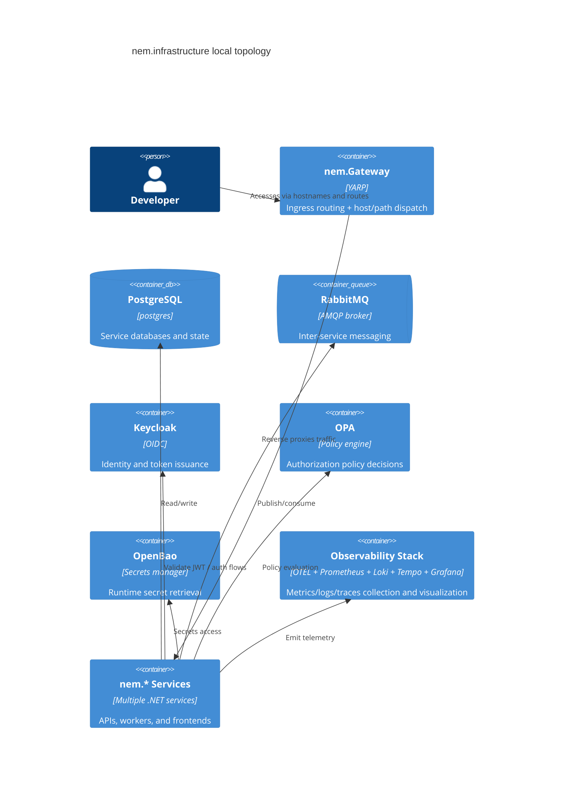

# Infrastructure Documentation: nem.infrastructure

## Summary
`nem.infrastructure` defines local and development deployment topology for the nem.* ecosystem. It provides compose-based stacks for core platform dependencies (database, broker, identity, policy, secrets), observability components, and a YARP gateway that routes host/subdomain traffic to service clusters.

## Deployment Scope and Boundaries
- Owns infrastructure composition files, gateway config, observability provisioning, and helper scripts.
- Does not own application business logic of individual nem.* services.
- Supports multiple run modes:
  - Full local platform stack (`docker-compose.yml`)
  - Classification/comms focused stack (`docker-compose.classification.yml`)
  - RabbitMQ-only transport bootstrap (`docker-compose.rabbitmq.yml`)

## Topology View (C4)

## Core Runtime Components
- **Gateway (`nem.Gateway`)**: loads `yarp-gateway.json`, applies env-based cluster address overrides, and exposes health endpoint `/health`.
- **Data & Messaging**: PostgreSQL 17, RabbitMQ 3.13 management image, plus optional postgres exporter/cAdvisor metrics.
- **Security Plane**: Keycloak (OIDC), OPA for policy checks, OpenBao for secrets.
- **Observability Plane**: OTEL collector fan-in with Prometheus (metrics), Loki (logs), Tempo (traces), Grafana dashboards/alerts.

## Compose and Routing Contracts
- `docker-compose.yml` expects external network `nem-network` and mounts `./yarp-gateway.json` into gateway container.
- `docker-compose.classification.yml` uses profile-scoped services and `.env.classification` for environment-specific values.
- `yarp-gateway.json` contains path-based API routes and host/subdomain routes with order precedence, including explicit base-path and catch-all variants to prevent route hijacking.

## Operational Constraints
- Many services assume sibling repository build contexts exist (e.g., `../nem.MCP`, `../nem.KnowHub`).
- Health checks are first-class and should remain consistent with service endpoints.
- `nem-network` must exist before compose startup when using files that declare external networking.
- Gateway behavior is sensitive to active config path; compose mounts must remain aligned with `/app/yarp-gateway.json`.

## Verification and Smoke Testing
- Infrastructure smoke test script: `scripts/test-full-stack.sh`.
- Script performs container health polling plus HTTP endpoint checks for key components (RabbitMQ UI, Keycloak, OPA, classification/comms APIs, MCP API/UI, Mimir, KnowHub).
- Prometheus scrape config (`prometheus/prometheus.yml`) captures telemetry from collector, selected services, infrastructure exporters, and cAdvisor.

## Cross-References and Glossary Usage
- Quick orientation and command examples: [README](./README.md)
- Existing documentation index: [INDEX](./INDEX.md)
- **Cluster Address Override**: env-driven replacement of reverse-proxy destination addresses.
- **Profile Stack**: selective compose activation via `profiles` in classification-focused deployment.
- **Ingress Contract**: stable host/path routing rules exposed by YARP to application surfaces.

## Change Impact Checklist
- Route changes in `yarp-gateway.json` require validation against currently running gateway config.
- Compose port or environment changes require smoke-test script and service docs synchronization.
- Observability config changes should preserve Grafana/Prometheus/Loki/Tempo compatibility and startup health.
